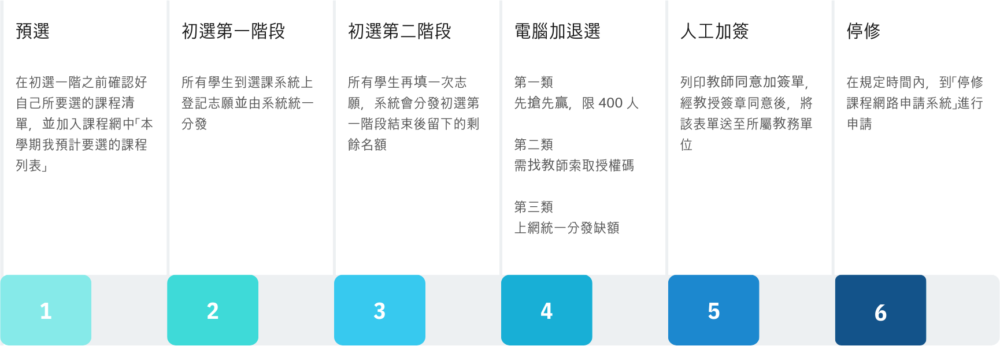
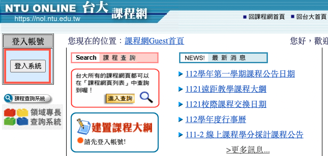
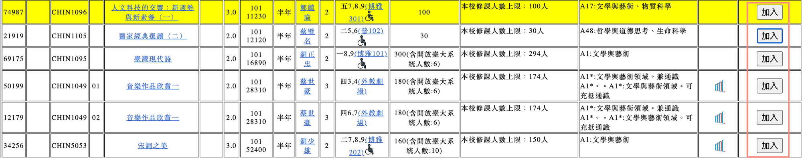
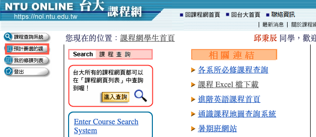
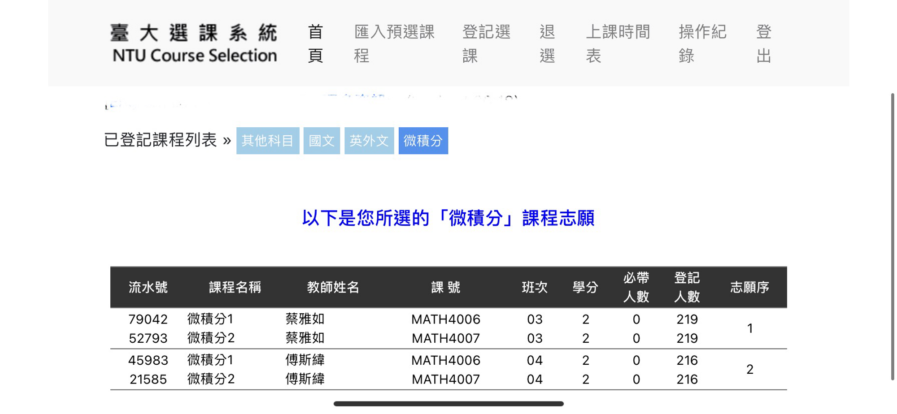
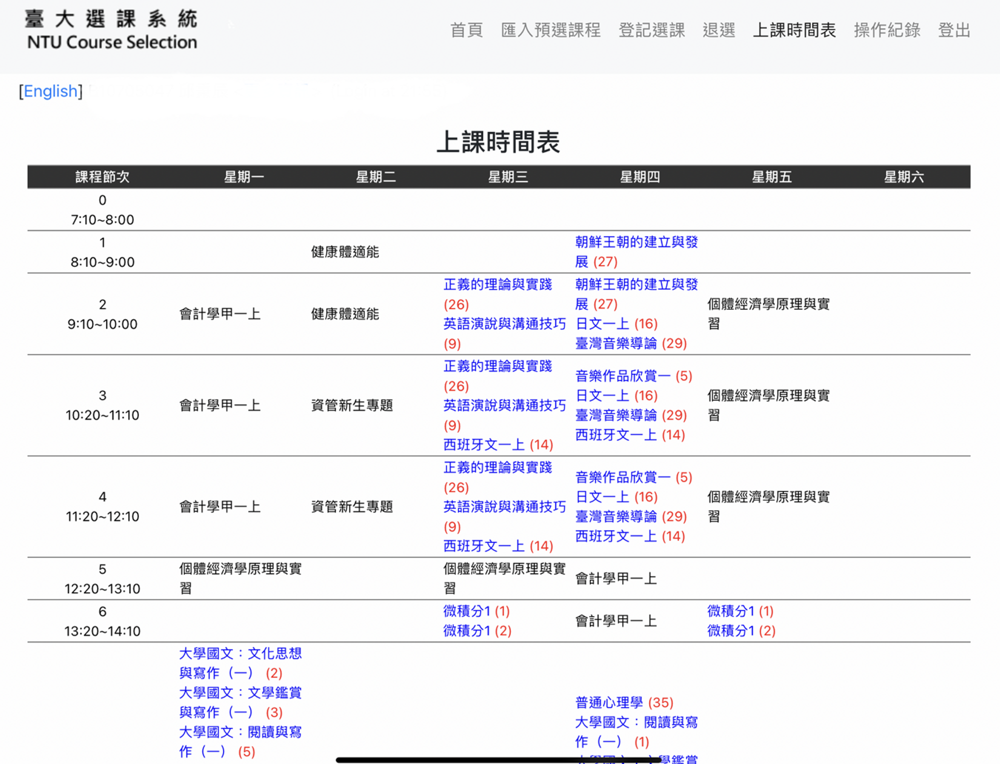
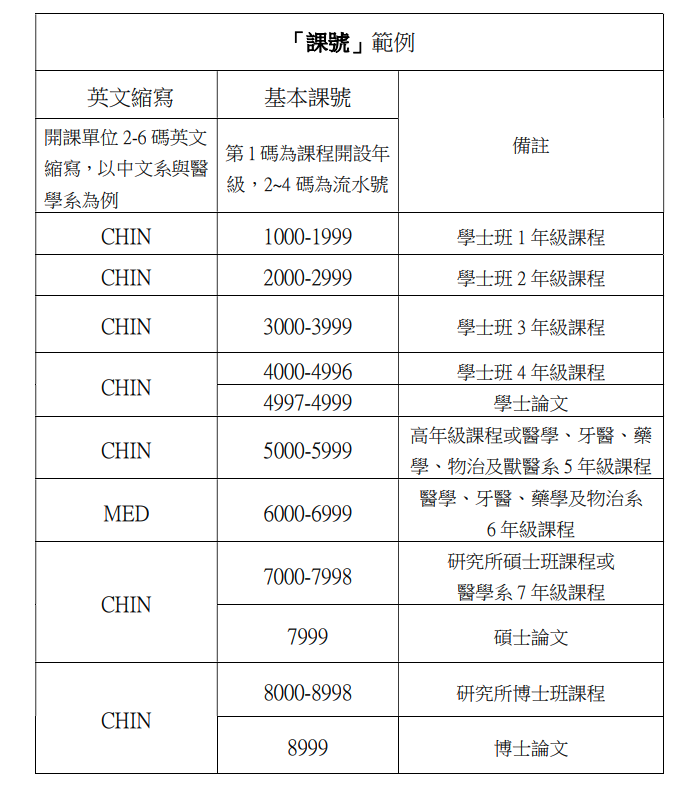
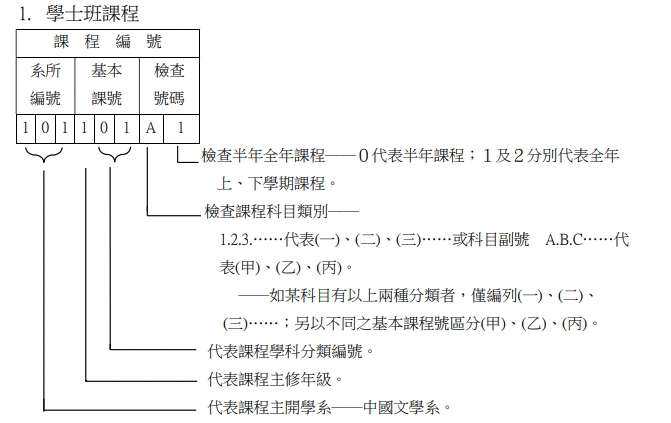
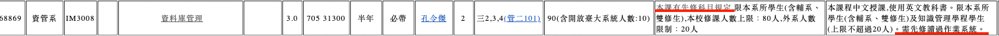

# 2023 台大新生選課 懶人包

> **作者：Benson Chiu** aka 班森
>
> - [benson_study_life](https://www.instagram.com/benson_study_life/) 廢文流讀書帳的版主
> - 台大資管系雙主修經濟系準備升大三的爆肝學生
> - 喜歡教學、到各地旅遊，興趣領域是資料科學、軟體開發
> - 我很討厭芋頭
>
> ---
>
> - **2023/08/09 更新** - 補上遺失的圖檔

## 前言

這份選課懶人包含以下單元：

- **選課流程**會簡單描述大家接下來將會遇到的一些**重要時間點**，以及在這個時間點各位**需要完成的事項**。
- **預選、初選、加退選、停修**會著重於解釋大家在選課各階段**操作步驟**以及需要注意的重點
- **補充資訊**包含共同課程的**詳細介紹**、**名詞解釋**、**擋修處理**與**初選、三類加選分發機制**
- **相關網站與實用資源**會提供給大家「修課規定」、「選課」與「課程評價」等**參考連結**

希望這一份懶人包可以對各位新鮮人有所幫助！ 歡迎來到台大 : )

## 選課流程

### 概要

### 時程

<iframe src="https://calendar.google.com/calendar/embed?height=600&wkst=2&bgcolor=%23ffffff&ctz=Asia%2FTaipei&title=112-1%20%E5%8F%B0%E5%A4%A7%E9%81%B8%E8%AA%B2%E6%97%A5%E7%A8%8B&src=Y18yZjBhNDJmOTEyNDc1YjdiOGU0YTQ1ZWYyMTBkNjQwMjU3ZWFkN2I4OWVhOTZjZmU0YjBmYmYyNTEzNGYxZjExQGdyb3VwLmNhbGVuZGFyLmdvb2dsZS5jb20&color=%23F4511E" style="border-width:0" width="800" height="600" frameborder="0" scrolling="no"></iframe>

## 預選

> 8/01 (二) ～ 8/17 (四)

### 什麼是預選？

所謂預選，就是指在初選一階之前確認好自己所要選的課程清單，並加入課程網中「本學期我預計要選的課程列表」。當我們將自己所要選的課程清單加入到這個列表過後，**在選課期間，我們可以直接把這個列表匯入至選課系統的志願表中**，我們到時候要做的事情就只剩下**微小的調整**和**選填志願**。

### 怎麼預選

1. 進入[台大課程網](https://nol.ntu.edu.tw/nol/guest/index.php)，並且**登入計中帳號**

2. 詳細閱讀**系所課程規定**

   - 各系所最新的**課程規定與學分規劃**可以到[各系所必修科目及應修學分資料查詢](http://140.112.161.31/NTUVoxCourse/index.php/uquery/index)

   - 或是直接進入自己系所的網頁查看課程規定。以台大資管系為例，可參照[此連結](https://management.ntu.edu.tw/IM/curriculum/undergraduate)

   - **每個系都會有自己的學分採計等的特別規定！**務必要詳細閱讀，並且**注意入學年份**

     > [重要] 系所課程規定攸關你四年後的**畢業門檻**，如果你對任何課程規定有不清楚的情形出現，**強烈建議直接詢問系辦！！！！**

2. 透過**課程查詢系統**，尋找並篩選你**可能在這學期會修習的課程**

   - **課程快速查詢** ：可以透過區塊查詢本學期的所有課程
   - **共同課程**： 國文、外文、英文
   - **系所課程** ：查詢各系所開設之必修、選修課
   - **通識/新生專題/新生講座/基本能力**
   - **體育、軍訓**

3. 若想要將課程加入到「我預計要選的課程列表」，點擊課程清單右側的**加入**

   

5. 點擊課程網左側的**「預計要選的課」**

   

​		便可查看**「我預計要選的課程列表」**

​																						

​		在該列表內的課程都可以被匯入至初選時會使用的**「選課系統」**，若要刪除，點選側邊欄的刪除鍵即可

> 台大目前亦有研發[新版課程網](https://course.ntu.edu.tw/)，唯獨現在**還在測試階段**，要使用台大 IP 登入才能使用，故今年入學的新生需要**拿到學生證**並**取得 VPN** 後才能在校外登入新版課程網！
>
> - 新課程網的使用說明：[臺大新版課程網使用教學 - HackMD](https://hackmd.io/kYlOI-zvT1qQQAn4POjxUA)

### 學分上下限

- [國立臺灣大學112學年度第1學期修課學分數上下限規定 (ntu.edu.tw)](https://www.aca.ntu.edu.tw/WebUPD/aca/UAADForms/112-1CREDIT.pdf)
- **大部分**學士班科系 - 大一至大三最低 15 學分  / 大四最低 9 學分 / 最高 25 學分
- **有例外**，請查閱學校規定
- 系排前 10％ 、GPA 3.9 以上或輔系 ：最高上限提高至 31 學分
- 雙主修 ： 最高上限提高至 33 學分
- **修課學分數上限會在初選二階調整！**
  - 也就是說：初選一階大家上限都是 25 學分

### 預選課表的小建議

1. 一開始，可以先排入下述類型的課程：
   - 被標註為**「必帶」**的必修課程
   - **各班次時間相同**的的必修課程
   - 其他 **100% 確定一定會選到**的課程
2. 排入完成後，查看自己空下來的時段，並排入自己有興趣的課程
3. 預排的時候，不用擔心衝堂或者時間衝突的問題，分發機制會幫你解決好。
4. **國文、英文、通識課都不好選**，所以**能排多一點課程，就排多一點課程**

>  台大選課就跟賭博一樣，真的不要報太大期望

## 初選

> ==初選一階== 8/18（五）～8/21（一），每日 9:00～次日凌晨 3:00
> ==初選二階== 8/25（五）～8/26（六），每日 9:00～次日凌晨 3:00
>
> 台大選課系統連結（擇一進入）：
>
> - [臺大選課系統ㄧ (ntu.edu.tw)](https://if177.aca.ntu.edu.tw/index.php)
> - [臺大選課系統二 (ntu.edu.tw)](https://if192.aca.ntu.edu.tw/index.php)
>
> 初選系統尚未公開，故只能用過去的截圖 (2021) 簡單說明
> 預計 08/19 晚上會開線上工作坊帶大家**實際操作一次**選課系統並介紹台大生活，歡迎大家參加！

### 系統操作說明 

> 這是 2021 & 2022 年的系統，今年還不知道會不會改

1. 當初選開始時，會有一個**「進入初選一 / 二階」**的按鈕，請直接點進去

2. 進入選課網頁後，應該會看到如下方的畫面（下面為 2021年選課系統班森的實際截圖）

   

   - 首頁：這邊會顯示您所選的課程列表，以**「國文」「英外文」「微積分」「其他科目」**區分

   - 匯入預選課程：選課系統會自動從將您課程網中**「本學期我預計要選的課程列表」**匯入課程，您可以對於您具有登記資格的課程填寫志願序

     > 志願序不要照順序填（如：1, 2, 3……)，**宜採用跳號的方式**（如：1, 3, 5, 7 …… / 1, 5, 10, 15……），這樣一來你之後想調整志願的次序時會方便非常多！ 系統是看數字的相對大小作志願分發的！

   - 登記選課：輸入 **「流水號」** or **「課號＋班次」**將課程加入志願表

   - 退選：如果你想要移除某些已經登記的課程，可以在這裡進行退選

     > **可以退必帶嗎？ **
     > 是可以的！但是您自己要做好未來的課程規劃以便在畢業前可以修完這些課

     > 健康體適能僅在上學期開設，通常**選課系統會自動將健康體適能帶入各位新生大一上的學期課表**。若因個人特殊因素無法隨班上課而退選，且欲選擇其他時段健康體適能課程，請先取得該時段授課教師同意後，再至體育室領取授權碼。

   - 上課時間表：

     你目前所選課程的概況，包含必帶課程（黑字）以及填好志願的課程（藍＋紅字）

     

   

## 加退選

> ==加退選時程請見上方的 **Google Calendar**==
>
> 加選網站和初選相同，皆為台大選課系統（擇一進入）：
>
> - [臺大選課系統ㄧ (ntu.edu.tw)](https://if177.aca.ntu.edu.tw/index.php)
> - [臺大選課系統二 (ntu.edu.tw)](https://if192.aca.ntu.edu.tw/index.php)

### 加退選方式說明

在加退選階段，初選時各門課所設定的身分限制皆不適用，但**第一類、第三類的先修科目限制為例外**

| 加選方式                | 簡述                                                         | 進行方式                                                     |
| ----------------------- | ------------------------------------------------------------ | ------------------------------------------------------------ |
| 第一類加選              | 課程加選以**先搶先贏**的方式進行，直到選課人數到達 **400人** 之上限。 | 在額滿前直接上網登記加選該課程                               |
| 第二類加選 **加簽大地** | 由各課程之授課教師所發放**授權碼**                           | 上選課系統用該授權碼登記加選該課程                           |
| 第三類加選              | 和初選類似，上選課系統**登記分發**                           | - 若登記人數大於剩餘名額 → 隨機分發 - 若登記人數小於剩餘名額 → 全數錄取 |
| 人工加簽                | 填寫**教師同意加簽單**                                       | 列印教師同意加簽單，經教授簽章同意後，將該表單送至所屬教務單位 |

> **第二類加選小撇步**
>
> 1. 授權碼發放方式通常會寫在課程網的**授課大綱**、**課程網站**，或是公布於**台大交流版 or 課程版 / ptt** 等，記得一定要時刻關注
> 2. 建議可以事先寄信給授課教師或者助教，老師們的 Email 都可以在課程網上找得到，務必信件內容**要符合書信禮儀且有禮貌**。
> 3. **第一堂課務必要到上課現場**，有些教授會在課堂上讓大家加簽（然後有可能第二堂課才去的話就不給你加選了）

## 停修

> **停修申請期限：11 月 24 日** 部分課程另有規定（如微積分），依該門課自行之規定為準

在規定時間內，到**「停修課程網路申請系統」**進行申請，下載同意書給予任課教師與系所主管簽章，完畢後將申請表與同意文件合併後在期限內上傳至申請系統。

1. 每學期停修以一科為限，若有特殊情況，可以填寫**「學生報告書」**
2. 停修課程會在**成績單上留下紀錄**，但是**不會計入學期 GPA**

> ==比較== 退選 vs 停修
>
> |      | 期限        | 成績單     | 學期成績 |
> | ---- | ----------- | ---------- | -------- |
> | 退選 | 09/18 08:00 | 不會出現   | 不會計入 |
> | 停修 | 11/24 17:00 | **會出現** | 不會計入 |
>
> 

## 補充資訊

### 初選分發規則

詳細規定請見 [國立臺灣大學學生選課辦法](https://www.aca.ntu.edu.tw/WebUPD/aca/UAADRules/選課辦法.pdf) 第十二條

#### 課程種類間的分發順位

- 第一順位：**國文領域**：
  - 上下學期**皆採獨立之志願登記**
  - 登記人數超過各課程規定之修課人數上限時，依**年級高低順序**分發
  - 未曾修讀國文領域課程學生，若尚有名額，再依**年級高低順序**分發
- 第二、三順位：**外(英)文領域、微積分**
  - **第一學期**皆採**獨立之志願登記**，第二學期**與==國文以外的課程==共同登記分發**
  - 登記人數超過各課程規定之修課人數上限時，則**以亂數分發**
  - 惟微積分得依開課單位規定**保留部分名額予大二以上學生**
- 第四順位：==**其他科目**==
  - 先處理**「一般通識」（不含兼通識的課程）**，再處理**剩下的科目**

#### 通識課程分發規則

- 優先分發各學系的**指定領域課程**
- 一般通識課程每門課初選階段各保留**四分之一名額**予**學士班一、二年級學生**
- 餘額再依**學生年級由高至低**分配。但**學士班學生**優先於**碩、博士班研究生**

#### 體育分發規則

必修學分 → 年級高低

#### 其餘課程分發規則

身份別 → 年級高低

### 第三類加選分發規則

- 登記人數超過修課人數上限時
  - **選修課**：亂數
  - **必修課：**身份別 → 亂數

> ==身份別== 
>
> - **本系所或雙主修優先** → **輔系次優** → 不具前述身份之身心障礙學生第三→ 其它學生最後
> - 若為**英文授課之課程**，以外籍生為第三優先，不具前述身份之身心障礙學生第四優先，其它學生最後
>
> ==年級高低==
>
> | 課程     | 第一優先年級          | 第二優先年級           | 第三優先年級 | 第四優先年級 |
> | -------- | --------------------- | ---------------------- | ------------ | ------------ |
> | 教育學程 | 大四,碩二, 博二及以上 | 大二, 大三, 碩一, 博一 | 其他         |              |
> | 其他課程 | 大四,碩二, 博二及以上 | 大三, 碩一, 博一       | 大二         | 大一         |

### 全校共同課程

#### 大一外文 [6 學分]

- 有些系**可以選擇各國語言**，有些系**限修英文**，需要注意
- [大一英文-選課注意事項 | 台大外文系 (ntu.edu.tw)](https://www.forex.ntu.edu.tw/大一英文-選課注意事項/#)
- 大一英文達到規定標準（滿足下列條件之一），可以**免修**
  - **通過全民英語能力分級檢定中高級初試與複試；**
  - **托福網路測驗（TOEFL iBT）八十三分（含）以上； **
  - **國際英語測試（IELTS Academic）六點五級（含）以上； **
  - 英國劍橋大學中等英文認證（FCE 或 FCE for Schools）Grade B（含） 以上； 
  - **國際溝通英語測驗（TOEIC）聽讀總分八百六十五分（含）以上，口說 一百七十分（含）以上，寫作一百六十五分（含）以上；**
  - 外語能力測驗（FLPT）之英語測驗聽讀總分兩百十七分（含）以上， 口說 S-2+級分（含）以上，寫作 B 級分（含）以上； 
  - TOEFL Essentials 八點五級（含）以上； 
  - AP Exams English Language and Composition 或 English Literature and  Composition 達到四級（含）以上；
  - 英語為母語之僑外生，檢具小學和中學畢業證書，或至少就讀五年之正 式官方成績單（兩者皆須於國際處規範之英語系國家取得）
  - [大一英文免修施行要點 (ntu.edu.tw)](https://curri.aca.ntu.edu.tw/waive_base/doc/大一英文免修施行要點.pdf)
- 大一英文達到規定標準（滿足下列條件之一），可以**參與免修考**
  - 「指定科目考試」英語科成績八十八分 （含）以上
  - 「學科能力測驗」成績達十五級分並於「大學入學考試中心高中英語聽力測驗」獲得 A 級分

- [免修申請：臺大學士班基礎學科免修申請系統 (ntu.edu.tw)](https://curri.aca.ntu.edu.tw/waive_base/waive_base.asp)

#### 大學國文 [6 學分 或 3 學分 ＋ 3 學分 A1 ~ A4 通識]

- [大學國文選課及修習注意事項(111-1 學年度，請隨時注意今年版本)](https://nol.ntu.edu.tw/nol/note/111-1/chi.htm)
- 大學國文達到規定標準（同時滿足下列條件），可以**參與免修考**
  - 大學入學學科能力測驗國文達十五級分，且國寫知性題與情意題成績兩題皆達 A
- [免修申請：臺大學士班基礎學科免修申請系統 (ntu.edu.tw)](https://curri.aca.ntu.edu.tw/waive_base/waive_base.asp)

#### 通識 [15 學分 或 18 學分 - 視國文學分而定]

- 通識課程分為 **A1 ~ A8 八大領域**
- 兼跨兩個領域者，得選擇**計入其中任一領域** 應修習系所規定的三個指定領域課程，其餘可自由修習
- 可修習**「溝通表達與職涯發展課程」**以計入通識學分，至多6學分。
- [重要連結] 
  - 請參考 [**各院系指定修習領域一覽表**](https://nol.ntu.edu.tw/nol/note/112-1/comarea.pdf)
  - 請參考 [**「通識課程」與「溝通表達與職涯發展課程」注意事項**](https://nol.ntu.edu.tw/nol/note/112-1/com.htm)

#### 進階英文一、二  [0 學分]

- 免修門檻**較大一英文低**
- [免修進階英語課程申請系統<課務組/進修教務組> (上學期的網站，提供大家參考)](https://investea.aca.ntu.edu.tw/secen-waive/OpenTime.asp)

#### 服務學習 [0 學分]

- 各系會有自己對於服務學習的規定，請**自行參照各系所的規定**

  > **班森的話：**
  > 奉勸各位一定要聽系辦的話準時交作業！！！！不然服務學習真的會被當......（我就被當了）

#### 體育 [4 學分]

- 活力體適能 1 學分  / 大一上學期的**必帶課程**
- 專項運動學群 3 學分 / 要自己**到選課系統填志願**

#### 國防 [0 學分]

- 嚴格來說不算必修，但男生修國防課**可以折抵兵役**
- 詳細資訊可以閱讀 [全民國防教育-課程資訊 (ntu.edu.tw)](https://ssc.ntu.edu.tw/nationaldefenseeducation1/Courseinformation#anchorPageTitle)

### 名詞索引

#### 系上課程規定會見到的課程種類

- 共同必修：全校各科系都要修的課程們 —— 包含：國文、外文、體育、通識、服務學習等等
- 系定必修：系上規定你**「一定要修」**的課
- 系定選修（或專業選修）：系上會提供給你一個**名單**，選擇裡面的課**修滿規定學分**
- 一般選修：可以任意選擇**各院系的課程**

---

#### 課程網裡面會看到的名詞

==必帶、必修、選修==

- 必帶：選課系統**直接幫你選好**並且**帶入到課表**的課程
- 必修：雖然屬於必修課程，但還是要**上網填志願**
- 選修：系上的選修課程，可能會 **兼通識**，資訊標註於備註欄

==選課限制==

不是所有加入課程網的課程都可以加入志願序，舉例來說

| 選課限制                                               | 加入到課程網 | 本系大一生 | 外系大一生 |
| ------------------------------------------------------ | ------------ | ---------- | ---------- |
| 初選不開放                                             | **O**        | **X**      | **X**      |
| 限本系所學生 (含輔系、雙修生)                          | **O**        | **O**      | **X**      |
| 限外系（所）學生                                       | **O**        | **X**      | **O**      |
| 限學士班三年級以上                                     | **O**        | **X**      | **X**      |
| 限本系所學生(含輔系、雙修生), 本校修課人數上限：100 人 | **O**        | **O**      | **X**      |
| 本校修課人數上限：100 人                               | **O**        | **O**      | **O**      |
| 本校修課人數上限：70人, 外系人數限制：10人             | **O**        | **O**      | **O**      |

==[冷知識] 課號、課程識別碼==

- [國立臺灣大學新增「課號」編碼作業說明](https://nol2.aca.ntu.edu.tw/nol/guest/課程編碼說明.pdf)

- 簡單來說，每一門課都有「課號」跟「課程識別碼」

  - 課號的編號方式：

  

  - 識別碼的編號方式：

    

### 先修科目規定（擋修）

- 部分系所的課程會設定**先修科目規定**，限制同學必須要**修習完畢指定課程**並達成**規定成績**才能修讀該課
- 有**先修科目規定**的課程，在**初選第二階段結束後**會被系統**擋修**
- 被**擋修**的處理方法：
  - 第一、第三類加選之課程：
    - 下載並填寫**「解除擋修申請書」**經授課教師及開課單位主管簽章同意，在規定期限內送至教務單位
  - 第二類加選之課程：
    - 下載並填寫**「解除擋修申請書」**經授課教師及開課單位主管簽章同意，在規定期限內送至教務單位
    - 直接找授課老師索取**授權碼**後登記選課

## 相關網站與實用資源

### 選課規定與相關文件

-  [112-1選課專區 - 國立臺灣大學教務處 (ntu.edu.tw)](https://www.aca.ntu.edu.tw/w/aca/UAADForms_21102811111810357)

### 選課網站

- [NTU Online臺大課程網](https://nol.ntu.edu.tw/nol/guest/index.php)
- [臺大選課系統ㄧ](https://if192.aca.ntu.edu.tw/index.php)
- [臺大選課系統二](https://if177.aca.ntu.edu.tw/index.php)

### 課程評價

- [想鑑你 NTU Rating (myntu.me)](https://rating.myntu.me/)
- [看板 NTUcourse 文章列表 - 批踢踢實業坊 (ptt.cc)](https://www.ptt.cc/bbs/NTUcourse/index.html)
- [台大課程資訊交流區 | Facebook](https://www.facebook.com/groups/581323785380794)

### 學分學程與領域專長

- [學分學程簡介與申請系統 (ntu.edu.tw)](https://ifsel3.aca.ntu.edu.tw/cou_stu/index.php/cur/cur-list)
- [國立台灣大學領域專長 (ntu.edu.tw)](https://specom.aca.ntu.edu.tw/)

---

 This work is licensed under a <a rel="license" href="http://creativecommons.org/licenses/by-nc-nd/4.0/">Creative Commons Attribution-NonCommercial-NoDerivatives 4.0 International License</a>. 本著作係採用[創用 CC 姓名標示-非商業性-禁止改作 4.0 國際 授權條款](http://creativecommons.org/licenses/by-nc-nd/4.0/)授權.

